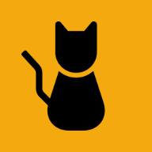

<!-- last_synced: 2026-05-15 -->

# Mewst (ミュースト)

> [English](./README.md) | 日本語

ほっとするマイクロブログ 
[» mewst.com](https://mewst.com/)

  

- [コミュニティ](https://wikino.app/s/mewst/pages/54)
- [コントリビューションについて](./CONTRIBUTING.ja.md)
- [セキュリティに関する報告](./SECURITY.ja.md)
