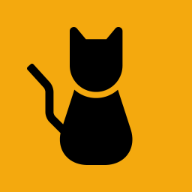

<div align="center">
  

  <h1 align="center">
    <b>Mewst (ミュースト)</b>
  </h1>

  <p align="center">
    ほっとするマイクロブログ
    <br>
    <a href="https://mewst.com/" rel="nofollow" target="_blank">
      <strong>mewst.com »</strong>
    </a>
  </p>

  [](https://github.com/mewstcom/mewst/actions/workflows/lint-and-test.yml)
  [](https://github.com/testdouble/standard)
  [](https://discord.gg/tNwVpJ4Jfk)
</div>

## リンク

- [ロードマップ](https://github.com/orgs/mewstcom/projects/1)
- [Discord](https://discord.gg/tNwVpJ4Jfk)
- [GitHub Issues](https://github.com/mewstcom/mewst/issues)

## 開発環境のセットアップ

```
git clone git@github.com:mewstcom/mewst.git
cd mewst
docker compose up
docker compose exec app bin/setup
docker compose exec app bin/dev
docker compose exec app bin/rails server
```
